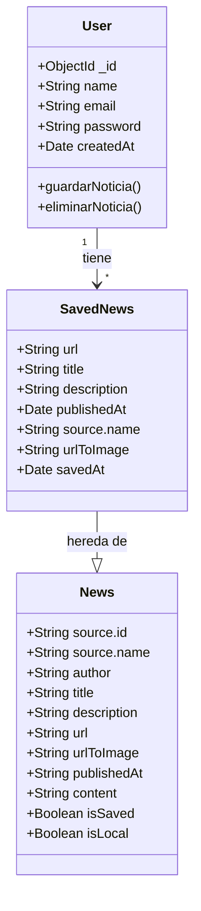

# NewsManager

NewsManager es una aplicación web moderna para la gestión y personalización de noticias. Permite a los usuarios ver, filtrar, y guardar noticias de diversas fuentes, con una interfaz intuitiva y responsive.

## Características Principales

- Autenticación de usuarios (registro, inicio de sesión)
- Visualización de noticias con filtros por categoría y fuente
- Guardado de noticias favoritas
- Perfil de usuario personalizable
- Interfaz responsive y moderna
- Sistema de caché para optimizar las peticiones a la API de noticias

## Requisitos Previos

Para ejecutar la aplicación necesitas tener instalado:

- Node.js (v18 o superior)
- Docker y Docker Compose
- Variables de entorno configuradas:
  - `JWT_SECRET`: Clave secreta para JWT
  - `NEWS_API_KEY`: API key de NewsAPI
  - `NEWS_API_URL`: URL base de NewsAPI

## Arquitectura

La aplicación sigue una arquitectura de microservicios con tres componentes principales:

### Frontend (Puerto 4000)
- Desarrollado con Angular 19
- Características:
  - SSR (Server-Side Rendering) para mejor SEO
  - Componentes standalone
  - Gestión de estado eficiente
  - Sistema de rutas protegidas
  - Interceptores para manejo de tokens

### Backend (Puerto 3000)
- Desarrollado con Node.js y Express
- Características:
  - API RESTful
  - Autenticación mediante JWT
  - Sistema de caché para optimizar peticiones
  - Middleware de autenticación
  - Proxy para NewsAPI
  - Integración con MongoDB

### Base de Datos
- MongoDB
- Almacena:
  - Información de usuarios
  - Preferencias
  - Noticias guardadas

## Instalación y Ejecución

1. Clonar el repositorio
2. Configurar las variables de entorno en un archivo `.env`
3. Ejecutar con Docker Compose:
```bash
docker-compose up --build
```

La aplicación estará disponible en:
- Frontend: http://localhost:4000
- Backend API: http://localhost:3000

## Desarrollo

Para desarrollo local sin Docker:

### Frontend
```bash
cd frontend
npm install
ng serve
```
El frontend estará disponible en http://localhost:4200

### Backend
```bash
cd backend
npm install
npm run dev
```
El backend estará disponible en http://localhost:3000

### Base de Datos
Asegúrate de tener MongoDB ejecutándose localmente o ajusta la variable de entorno `MONGODB_URI` para apuntar a tu instancia de MongoDB.

## Scripts Disponibles

### Frontend
- `ng serve`: Inicia el servidor de desarrollo
- `ng build`: Compila el proyecto
- `ng test`: Ejecuta los tests unitarios
- `ng e2e`: Ejecuta los tests end-to-end

### Backend
- `npm run dev`: Inicia el servidor en modo desarrollo con nodemon
- `npm start`: Inicia el servidor en modo producción
- `npm test`: Ejecuta los tests

## Estructura del Proyecto

```
news-manager/
├── frontend/                # Aplicación Angular
│   ├── src/
│   │   ├── app/
│   │   │   ├── components/ # Componentes de la aplicación
│   │   │   ├── services/   # Servicios
│   │   │   ├── models/     # Interfaces y tipos
│   │   │   └── guards/     # Guards de rutas
│   └── ...
├── backend/                 # Servidor Node.js
│   ├── config/             # Configuración
│   ├── controllers/        # Controladores
│   ├── middleware/         # Middleware
│   ├── models/            # Modelos de datos
│   ├── routes/            # Rutas de la API
│   └── services/          # Servicios
└── docker-compose.yml     # Configuración de Docker
```
## Modelo de Datos

La aplicación implementa una estructura de datos relacional donde los usuarios pueden guardar múltiples noticias, similar a una relación "uno a muchos".

### Diagrama de Relaciones



### Tablas de Modelo de Datos

#### Usuario (User)

| Campo      | Tipo     | Descripción                    | Requerido |
|------------|----------|--------------------------------|-----------|
| _id        | ObjectId | ID único de MongoDB           | Sí        |
| name       | String   | Nombre del usuario            | Sí        |
| email      | String   | Email único del usuario       | Sí        |
| password   | String   | Contraseña hasheada          | Sí        |
| createdAt  | Date     | Fecha de creación            | Sí        |

#### Noticia Guardada (SavedNews)

| Campo       | Tipo     | Descripción                   | Requerido |
|------------|----------|-------------------------------|-----------|
| url        | String   | URL única de la noticia      | Sí        |
| title      | String   | Título de la noticia         | Sí        |
| description| String   | Descripción del contenido    | No        |
| publishedAt| Date     | Fecha de publicación        | Sí        |
| source.name| String   | Nombre de la fuente         | Sí        |
| urlToImage | String   | URL de la imagen            | No        |
| savedAt    | Date     | Fecha de guardado           | Sí        |

#### Noticia (News)

| Campo       | Tipo     | Descripción                   | Requerido |
|------------|----------|-------------------------------|-----------|
| source.id  | String   | ID de la fuente             | No        |
| source.name| String   | Nombre de la fuente         | Sí        |
| author     | String   | Autor del artículo          | No        |
| title      | String   | Título del artículo         | Sí        |
| description| String   | Descripción corta           | No        |
| url        | String   | URL única del artículo      | Sí        |
| urlToImage | String   | URL de la imagen            | No        |
| publishedAt| String   | Fecha de publicación        | Sí        |
| content    | String   | Contenido completo          | No        |
| isSaved    | Boolean  | Estado de guardado          | No        |
| isLocal    | Boolean  | Es noticia local            | No        |

### Relaciones y Cardinalidad

- Un **Usuario** puede guardar múltiples **Noticias** (1:N)
- Cada **Noticia Guardada** pertenece a un único **Usuario** (N:1)
- Las **Noticias Guardadas** heredan propiedades del modelo **Noticia**

## Patrones de Diseño

### Patrón Repository
- Implementado en `ScrapingService` y `NewsService`
- Abstrae el acceso a datos y la lógica de negocio
- Proporciona una interfaz unificada para acceder a los datos
- Facilita el cambio de fuentes de datos sin afectar la lógica de negocio

### Patrón Observer
- Utilizado en servicios Angular (`NewsService`, `AuthService`)
- Implementa comunicación reactiva entre componentes
- Gestiona actualizaciones en tiempo real
- Maneja el estado de la aplicación de forma eficiente

### Patrón Factory
- Usado en la creación de instancias de noticias y usuarios
- Centraliza la lógica de creación de objetos
- Facilita la modificación de la lógica de creación

### Patrón Middleware
- Implementado en el backend para autenticación y validación
- Procesa las solicitudes HTTP de forma secuencial
- Permite la reutilización de lógica común

## API Endpoints

### Autenticación
- `POST /api/auth/register`: Registro de usuario
- `POST /api/auth/login`: Inicio de sesión
- `GET /api/auth/user`: Obtiene datos del usuario
- `PUT /api/auth/user`: Actualiza datos del usuario

### Noticias
- `GET /api/news`: Lista de noticias con filtros
- `GET /api/news/local`: Noticias locales

### Preferencias
- `PUT /api/preferences/saved-news`: Gestiona noticias guardadas
- `GET /api/preferences/saved-news`: Obtiene noticias guardadas

## Seguridad

La aplicación implementa varias capas de seguridad:

### Frontend
- Guards de autenticación para rutas protegidas
- Interceptores HTTP para tokens JWT
- Saneamiento de datos y protección XSS
- CSRF protection

### Backend
- Autenticación basada en JWT
- Middleware de autenticación para rutas protegidas
- Rate limiting
- CORS configurado
- Sanitización de entrada
- Validación de datos

### Docker
- Contenedores sin privilegios root
- Healthchecks implementados
- Secrets management
- Volúmenes para persistencia segura
- Network isolation

